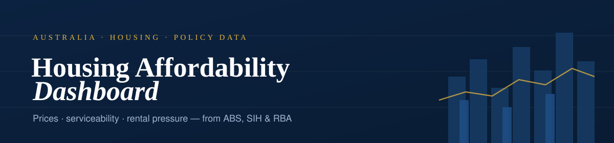

<div align="center">



<br/>

[](https://anthonypuggs-housing-affordability-dashboard.share.connect.posit.cloud/)
[](https://github.com/AnthonyPuggs/Housing-Affordability-Dashboard/search?l=r)
[](https://shiny.posit.co/)
[](#where-the-data-comes-from)
[](https://rstudio.github.io/renv/)
[](LICENSE)

</div>

> **Australian housing affordability is contested terrain — and the data behind it is easy to misread.**
> This dashboard brings official ABS, SIH and RBA-derived measures together in one interactive
> R / Shiny interface, with a discipline that runs through every page: **observed survey burden and
> modelled market-entry scenarios are never blurred together.**

It pairs a headline **National Market-Entry Affordability Score** — a relative, historical-window
index — with the official Survey of Income and Housing burden measures that sit beside it, each
clearly labelled for what it is.

**[▶ Open the live dashboard](https://anthonypuggs-housing-affordability-dashboard.share.connect.posit.cloud/)** &nbsp;·&nbsp; [Methodology](#methodology--provenance) &nbsp;·&nbsp; [Run it locally](#run-it)

---

## The core distinction

Two kinds of number, never mixed:

| | Official · SIH / NHHA | Modelled · stylised |
| --- | --- | --- |
| **What it is** | ABS Survey of Income and Housing measures of *observed* household housing costs, gross-income cost ratios and lower-income renter stress. | Serviceability, deposit-gap and calculator outputs built on *fixed assumptions* for a stylised household. |
| **How it's used** | Treated as official survey burden/stress measures, with relative-standard-error and 95% margin-of-error metadata surfaced as reliability markers (`†`). | Useful for scenarios — but **not** official ABS measures or lender assessments, and always labelled as such. |

> The **National Market-Entry Affordability Score** is a modelled, relative index — higher means
> easier market entry versus 2012–2025 history, *not* the share of households who can afford housing.

---

## The dashboard

Eight focused pages:

| # | Page | What it shows |
| :-: | --- | --- |
| 1 | **Overview** | Headline affordability score, component contributions and an official SIH burden snapshot. |
| 2 | **Price Trends** | Capital-city dwelling price indexes and ABS rent CPI movements. |
| 3 | **Affordability** | Official SIH burden bands, market-entry scenarios and a serviceability calculator. |
| 4 | **Geographic Affordability** | SIH-only, geography-aligned cost-to-income comparisons across states and capitals. |
| 5 | **Market Context** | Labour spare capacity, residential mortgage rates and population-demand drivers. |
| 6 | **Housing Supply** | Building approvals by state, type and sector, plus construction-cost pressure. |
| 7 | **Rental Market** | NHHA rental stress, rental cost pressure and SIH rental-cost estimates. |
| 8 | **Methodology** | Registry-backed indicator formulas, source series and interpretation caveats. |

### The score

Version 1 of the composite combines three component scores at fixed weights:

| Component | Weight | Captures |
| --- | :-: | --- |
| **Mortgage serviceability** | `40%` | Monthly repayment burden |
| **Rental entry** | `35%` | Rent pressure relative to wages |
| **Deposit barrier** | `25%` | Upfront saving barrier |

It's a historical-relative monitoring index, not a lender assessment. Official SIH/NHHA stress
measures stay separate throughout — they describe observed household burden, not modelled
market-entry conditions.

---

## Where the data comes from

- **ABS** — prices, CPI, labour and supply series, plus the Survey of Income and Housing (SIH / NHHA).
- **RBA** — cash and mortgage-rate inputs from the F-series tables.
- **Derived** — affordability indices and the National Market-Entry Affordability Score.

Built with **R**, **Shiny** and **bslib** (Bootstrap 5, native dark/light mode), charts rendered
with **Plotly**, using local system fonts only — no third-party font fetches at launch.

---

## Run it

The package set is pinned with [`renv`](https://rstudio.github.io/renv/) for reproducible runs. The
app reads saved CSVs from `data/`, so it launches without refreshing live ABS/RBA inputs:

```bash
Rscript -e "renv::restore()"      # restore the pinned packages
Rscript -e "shiny::runApp('.')"   # launch the dashboard
```

<details>
<summary>No <code>renv</code>? Install the runtime packages manually</summary>

```r
install.packages("renv")   # recommended

# or install the direct runtime + pipeline packages:
install.packages(c(
  "shiny", "bslib", "ggplot2", "plotly", "dplyr", "tidyr", "purrr",
  "stringr", "scales", "readr", "readxl", "readabs", "lubridate",
  "httr", "rlang", "watcher"
))
```
</details>

### Refresh the data

Run the full pipeline from the repository root. It parses local ABS SIH workbooks, retrieves public
ABS/RBA series, derives the indicators and validates every output against per-stage contracts:

```bash
Rscript pipeline/05_driver.R
```

### Verify

Lightweight base-R tests cover the pipeline, every page module, methodology text and visual
semantics. Before publishing, run the release-readiness checklist:

```bash
Rscript tests/test_pipeline_outputs.R
Rscript -e "source('R/release_checklist.R'); validate_release_checklist()"
```

---

## Methodology & provenance

The provenance chain is explicit and auditable:

```
pipeline/05_driver.R  →  06_validate_outputs.R  →  data/*.csv  →  R/indicator_registry.R  →  dashboard labels
```

`R/indicator_registry.R` is the single source of truth for derived indicator formulas, source
series, units and interpretation direction — and the in-app **Methodology** page is generated from
it, alongside a downloadable methodology summary and a data-source audit.

#### Key caveats

- AWE is individual earnings, not household disposable income; WPI is a wage price index, not an income-distribution measure.
- CPI rents and CPI new-dwelling indexes are price indexes, not household burden measures.
- Assessment-buffer, deposit, LVR and loan-term inputs are sensitivity assumptions, not a lender assessment.
- KPI colours encode economic *interpretation* (better / worse / neutral), not raw up/down movement.
- SIH estimates are survey estimates — interpret with caution where relative standard error is high.

---

<div align="center">
<sub>

[Live dashboard](https://anthonypuggs-housing-affordability-dashboard.share.connect.posit.cloud/) &nbsp;·&nbsp;
Data: ABS · SIH · RBA &nbsp;·&nbsp; Built in R with Shiny & Plotly &nbsp;·&nbsp; Brisbane, Australia

</sub>
</div>
