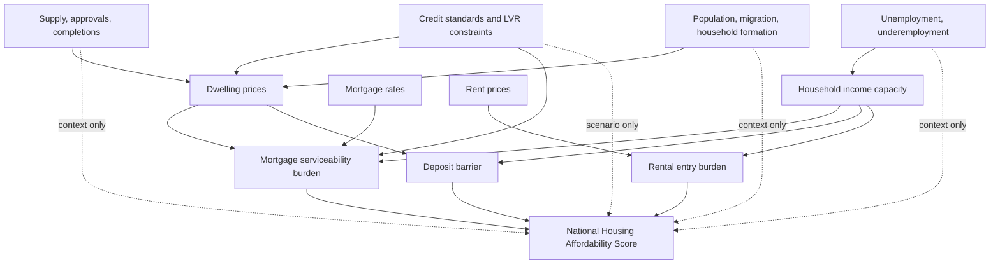

# National Housing Affordability Score Methodology Specification

Date: 2026-05-03 (v1) · 2026-06-11 (v2)
Status: v2 implemented in the dashboard pipeline and Overview page. The score is saved in `data/affordability_indices.csv` alongside its three component scores.

## V2 Changes (2026-06-11)

Version string: `national_affordability_score_v2` (`R/national_affordability_score.R`); the mortgage serviceability input is versioned `affordability_indices_v2` in `R/indicator_registry.R`. Weights are **unchanged** at 40/35/25. Three methodology changes, each resolving a finding of the 2026-06-10 code review (`docs/code_review_2026-06-10.md`):

### 1. Mortgage serviceability input is now a principal-and-interest annuity burden (ECON-02, STAT-10)

v1 used `indexed price × rate / indexed WPI` — an interest-only construction that this document's own component definition (P&I repayments / income) did not match, and which overstates rate swings (a 3%→6% rate doubles the v1 input; true P&I repayments rise roughly 40%).

v2 input, quarterly:

```text
loan_t        = 0.80 × national mean dwelling price_t          (ABS 6432.0 Table 1, dollars)
payment_t     = 30-year monthly annuity payment on loan_t at new_loan_rate_t
burden_t      = payment_t / WPI_t                              (WPI as the income-growth proxy)
MSI_v2_t      = 100 × burden_t / burden_base                   (indexed at first observation)
```

The 80 per cent LVR and 30-year term are stylised loan assumptions, disclosed in the indicator registry. WPI remains the income denominator (consistent with v1 and the rental component); the score is rank-based, so only the burden's shape matters, and the annuity shape is the correction.

### 2. Rate source: actual new-loan rates, spliced (ECON-06)

v1 used the RBA F5 *advertised discounted* variable owner-occupier rate, which has sat well above rates actually paid since the mid-2010s. v2 uses the RBA F6 series **"Lending rates; Housing credit; New loans funded in the month; Owner-occupied; All loans; All institutions"** — rates on loans actually funded.

F6 begins 2019-07. To preserve the 2012-onward score history, pre-2019-07 history uses the F5 discounted series level-adjusted down by the mean F5−F6 gap over the **fixed** overlap window 2019-07 to 2021-06 (estimated wedge ≈ 1.0 percentage point at implementation). The window is fixed so the spliced history does not mutate as new data arrives; changing it requires a version bump. Implementation: `rba_new_loan_rate_spliced()` in `R/indicator_registry.R`, also used by the Overview serviceability chart. Caveat: the advertised-vs-actual wedge was not constant over the 2010s, so pre-2019 levels are an approximation; within-segment dynamics are F5's.

### 3. Frozen percentile reference window (ECON-04, STAT-04)

v1 re-ranked and re-winsorised the full growing sample on every data refresh: previously published scores mutated silently, and a quarter's score depended on data that arrived later — contradicting this document's fixed-window rule.

v2 freezes the normalisation reference to the window **2012-07-01 to 2025-12-31** (`NATIONAL_AFFORDABILITY_SCORE_REFERENCE_END`). Winsorisation bounds (5th/95th percentiles) and percentile ranks are computed from reference-window observations only; quarters after the window are scored against that frozen distribution and clamp to 0/100 beyond its range. Consequences:

- Published score history no longer changes when new quarters arrive, and no quarter's score depends on later data.
- Post-window scores are interpretable as "relative to 2012–2025 conditions"; the Overview card states this basis.
- **Revision policy:** extending or changing the reference window requires a methodology version bump. Residual revision channel: upstream ABS/RBA revisions to input history can still move reference values; this is disclosed on the methodology page.

### One-time v1→v2 history break

Switching the mortgage input necessarily revises the published score history once at the v2 release (quantified in the implementing commit message). The rental-entry and deposit-barrier burden inputs are unchanged; their component scores move only where the complete-case sample interacts with the frozen window.

### Income denominator evaluation (FR-P1-6 — evaluated, deferred)

The preferred denominator remains median household disposable income. Evaluation findings: ABS 5206.0 provides only Compensation of Employees as an aggregate proxy (the pipeline's stage 02 already notes that household disposable income lives in the 5220.0 household income account, which is not fetched); converting any aggregate to a per-household measure requires a household-count divisor, and no clean quarterly ABS household-count series exists — it would need interpolation from ERP and household projections. That is a substantive, separately-versioned change. v2 therefore retains the WPI/AWE proxies with explicit labelling, as sanctioned by the v1 practical-proxy column in the component table below.

## Executive Decision

The dashboard should use a front-page **National Housing Affordability Score** only if it is presented as a modelled market-entry composite indicator. The score should not be described as an official ABS, NHHA, lender, or welfare-stress statistic.

Recommended label:

> National Housing Affordability Score
>
> Modelled national market-entry score. Higher means more affordable. Not an official ABS or lender assessment.

The score should answer one public-facing question: **has national market-entry affordability for a typical household improved or deteriorated relative to its own recent history?** It should not claim to answer whether every household can afford suitable housing, whether lower-income households are in stress, or whether a causal driver has changed affordability.

Recommended default construction:

| Dimension | Default weight | Direction | Core concept |
|---|---:|---|---|
| Mortgage serviceability | 40 per cent | Higher score = lower repayment burden | Buying with a mortgage at current prices and rates |
| Rental entry affordability | 35 per cent | Higher score = rents lower relative to income | Entering a private rental tenancy |
| Deposit barrier | 25 per cent | Higher score = smaller deposit burden | Saving the upfront deposit for ownership |

Do not add real wage growth, real mortgage rates, unemployment, underemployment, population growth, building approvals, or credit standards as separate headline components in the default score. Use them as context, diagnostics, or robustness checks. This avoids double-counting and reduces endogeneity/confounding risk.

## Evidence Base

### Official Australian measurement

The ABS Survey of Income and Housing (SIH) frames housing affordability through housing costs relative to household income and notes the common 30 per cent threshold, especially for lower-income households in the bottom 40 per cent of the equivalised disposable income distribution. This is the basis of the Australian "30/40 rule" housing-stress convention. The ABS also warns that affordability ratios depend on the treatment of rent assistance, household size, tenure, household preferences, and principal repayment in mortgage costs. Source: [ABS SIH User Guide, Housing](https://www.abs.gov.au/statistics/detailed-methodology-information/concepts-sources-methods/survey-income-and-housing-user-guide-australia/2019-20/housing).

ABS Housing Occupancy and Costs reports lower-income household burden measures by tenure. In 2019-20, lower-income private renters had average housing costs equal to 32 per cent of gross weekly income, and more than half of lower-income private renters spent more than 30 per cent of gross income on housing costs. Source: [ABS Housing Occupancy and Costs 2019-20](https://www.abs.gov.au/statistics/people/housing/housing-occupancy-and-costs/latest-release).

The ABS Census rent and mortgage affordability indicators use the same broad ratio logic, classifying in-scope households by whether rent or mortgage repayments are more than 30 per cent of imputed household income. The ABS explicitly cautions that these ratios can overstate burden and that payments above 30 per cent do not necessarily imply financial stress. Sources: [ABS RAID](https://www.abs.gov.au/census/guide-census-data/census-dictionary/2021/variables-topic/housing/rent-affordability-indicator-raid) and [ABS MAID](https://www.abs.gov.au/census/guide-census-data/census-dictionary/2021/variables-topic/housing/mortgage-affordability-indicator-maid).

Implication for the dashboard: official SIH/NHHA and Census burden measures should be validation and context, not ingredients in a timely market-entry score. They measure observed household burden and are not the same concept as new-entry affordability.

### International market-entry indicators

New Zealand's Change in Housing Affordability Indicators (CHAI) are the closest conceptual analogue for this dashboard. CHAI measures changes in affordability for people entering renting, saving for a deposit, and servicing a mortgage. Each component compares price movements with median household disposable income. CHAI is explicitly a change indicator, not an absolute affordability level. Source: [NZ HUD CHAI About the Indicators](https://www.hud.govt.nz/stats-and-insights/change-in-housing-affordability-indicators/about-the-indicators) and local reference `resources/housing_afford_indic_methods_NZ.pdf`.

The US National Association of Realtors Housing Affordability Index (NAR HAI) measures whether a median-income family has enough income to qualify for a mortgage on a median-priced home, assuming a 20 per cent down payment and a conventional mortgage repayment. An index of 100 means exactly enough qualifying income; above 100 means more than enough. Source: [NAR HAI methodology](https://www.nar.realtor/topics/housing-affordability-index/methodology).

The NAR Affordability Distribution Curve and Score extends beyond the median household by comparing the income distribution to active inventory. It is conceptually stronger but requires listing-level inventory and household income distribution data that are not currently part of this dashboard. Source: [NAR Affordability Distribution Curve methodology](https://www.nar.realtor/research-and-statistics/housing-statistics/realtors-affordability-distribution-curve-and-score/methodology).

The OECD treats price-to-income and price-to-rent ratios as standard analytical housing price indicators. The price-to-income ratio is a broad affordability proxy, while price-to-rent is closer to an ownership valuation or tenure-arbitrage measure. Source: [OECD housing prices](https://www.oecd.org/en/data/indicators/housing-prices.html).

Implication for the dashboard: the score should be a transparent market-entry score with explicit subcomponents, closer to CHAI than to a welfare-stress statistic.

### Composite-indicator guidance

The OECD/JRC composite-indicator handbook emphasises a theoretical framework, careful variable selection, treatment of missing data, multivariate analysis, normalisation, weighting, aggregation, robustness, sensitivity testing, links to external variables, and clear presentation. It warns that composites can mislead if poorly constructed, hide weak dimensions, and embed arbitrary weights. Source: [OECD/JRC Handbook on Constructing Composite Indicators](https://www.oecd.org/en/publications/handbook-on-constructing-composite-indicators-methodology-and-user-guide_9789264043466-en.html).

Important implications:

- Weights are value judgements, even when they appear statistical.
- Highly correlated indicators can double-count a single dimension.
- Equal weighting is still a weighting choice and can accidentally overweight dimensions that have more variables.
- Sensitivity and robustness analysis are required for credibility.
- The published score should include component decomposition, not just a single number.

### Ratio, residual-income, and household heterogeneity literature

The residual-income literature argues that affordability should reflect whether households have enough income left after housing costs to meet non-housing necessities. AHURI's residual-income work presents this as a conceptually stronger alternative to simple ratio thresholds such as the 25 per cent social-housing convention or the 30/40 rule. Source: [AHURI residual-income approach](https://www.ahuri.edu.au/sites/default/files/migration/documents/AHURI_Positioning_Paper_No139_The-residual-income-approach-to-housing-affordability-the-theory-and-the-practice.pdf).

Harvard Joint Center for Housing Studies evidence finds that the 30 per cent standard is imperfect and can overstate burden for some higher-income, smaller, or high-cost-market households, but it remains a useful simple indicator over time and across markets. Source: [Harvard JCHS 30 per cent standard paper](https://www.jchs.harvard.edu/research-areas/working-papers/measuring-housing-affordability-assessing-30-percent-income-standard).

RBA research on credit constraints shows why credit variables should be handled carefully. The price response to collateral constraints depends on marginal buyers, not average households. Financing conditions and prices are jointly determined, and credit constraints vary endogenously with expectations, prices, regulation, and household composition. Source: [RBA RDP 2023-01](https://www.rba.gov.au/publications/rdp/2023/2023-01/full.html).

Implication for the dashboard: residual-income and credit-constraint concepts are valuable but should not be forced into the default headline score without household-level data and stronger assumptions. They are better suited to scenario analysis, robustness, or a later distributional extension.

## Conceptual Framework

The score measures market-entry capacity. It is descriptive and index-based.



Direct score dimensions are burden ratios or burden indexes. Upstream drivers are contextual because they are endogenous, lagged, and not direct affordability outcomes.

The score should not be interpreted causally. A fall in the score can be decomposed into rent, mortgage, and deposit components, but that decomposition does not prove what caused the change.

## Candidate Variable Classification

| Candidate variable | Preferred source or existing proxy | Frequency | Economic rationale | Expected sign in burden measure | Endogeneity or confounding risk | Double-counting risk | Final classification |
|---|---|---:|---|---|---|---|---|
| Dwelling price index or national dwelling price | ABS RPPI or dashboard national price series | Quarterly | Core purchase price and deposit input | Higher = less affordable | Prices are equilibrium outcomes of supply, demand, credit and expectations | High if used in both mortgage and deposit dimensions | Core input |
| Mortgage interest rate | RBA owner-occupier mortgage-rate series | Monthly to quarterly | Determines repayment burden for new mortgage entry | Higher = less affordable | Rates respond to macro conditions and affect prices | Medium, if real mortgage rate is also included | Core input |
| Mortgage repayment burden | Derived from price, rate, LVR, loan term and income | Quarterly | Captures ability to service a purchase | Higher = less affordable | Uses assumptions about loan type and income proxy | Medium with deposit and price-to-income | Core dimension |
| Rent price index or rent CPI | CPI rents, advertised rent series if later added | Quarterly or monthly | Captures rental entry cost pressure | Higher = less affordable | CPI rents may lag new-lease rents; advertised rents have composition issues | Low to medium | Core dimension |
| Income denominator | Preferred: median household disposable income; v1 proxy: WPI/AWE with caveat | Quarterly or annual | Common denominator for affordability capacity | Higher income = more affordable | Income composition and household formation can shift | High if income growth also included separately | Core input |
| Deposit gap or years to save | Derived from price, deposit share, income and savings-rate assumption | Quarterly | Captures upfront ownership barrier | Higher = less affordable | Savings behaviour varies by household and macro cycle | Very high with price-to-income in current data | Core dimension, but do not also include price-to-income |
| Price-to-income ratio | RPPI divided by WPI or disposable income | Quarterly | Simple ownership affordability proxy | Higher = less affordable | Broad and partial; ignores rates | Very high with deposit gap | Diagnostic or fallback only |
| Real wage growth | WPI deflated by CPI | Quarterly | Captures income momentum | Higher = more affordable | Labour-market composition and inflation shocks | High because income already enters all ratios | Context and momentum note only |
| Real mortgage rate | Mortgage rate minus CPI inflation | Monthly to quarterly | Useful finance context | Higher = less affordable | Inflation, monetary policy and prices jointly move | High with mortgage serviceability and real wage growth | Context only |
| Unemployment or underemployment | ABS labour force | Monthly | Captures income security and repayment risk | Higher = less affordable | Cyclical and jointly determined with income and rates | Medium | Context only |
| Building approvals or completions | ABS building approvals and completions | Monthly or quarterly | Medium-run supply pipeline | More supply may improve affordability | Highly lagged and endogenous to prices, rates and planning | Low direct, high causal ambiguity | Context only |
| Population growth or migration | ABS population and NOM | Quarterly or annual | Demand pressure and household formation | Higher pressure may reduce affordability | Strong policy, labour-market and housing-cost feedback | Low direct, high causal ambiguity | Context only |
| Credit standards, LVR or serviceability buffer | APRA/RBA/lender assumptions | Irregular or scenario | Determines feasible borrowing and deposit constraints | Tighter = less affordable | Strongly endogenous to risks and policy | Medium with mortgage and deposit | Scenario control only |
| Residual-income living-cost measure | Household expenditure or microsimulation | Annual or lower | Stronger welfare concept after non-housing necessities | Higher residual income = more affordable | Household-type assumptions, tax-transfer modelling | Medium | Future extension only |
| SIH/NHHA lower-income stress | ABS SIH workbooks and NHHA measure | Biennial or slower | Official observed burden/stress benchmark | Higher stress = less affordable | Survey timing, sampling error, policy treatment of rent assistance | Different concept, not double count | Validation benchmark only |

## Current Repo Diagnostic

The current saved `data/affordability_indices.csv` contains national derived indicators from 1997-07-01 to 2026-01-01. A quick diagnostic on 2026-05-03 found:

| Indicator | Rows |
|---|---:|
| Deposit Gap (Years) | 31 |
| Mortgage Serviceability Index | 58 |
| Price-to-Income Ratio | 58 |
| Real House Price Growth YoY | 54 |
| Real Mortgage Rate | 88 |
| Real Wage Growth YoY | 110 |
| Rental Affordability Index | 114 |

High absolute correlations in current derived data:

| Pair | Correlation |
|---|---:|
| Deposit Gap (Years) and Price-to-Income Ratio | 0.998 |
| Deposit Gap (Years) and Mortgage Serviceability Index | 0.850 |
| Mortgage Serviceability Index and Price-to-Income Ratio | 0.849 |
| Real Mortgage Rate and Real Wage Growth YoY | 0.910 |

These correlations confirm the main statistical risk: a naive composite that includes deposit gap, price-to-income, mortgage serviceability, real wage growth and real mortgage rates at equal weight would double-count house prices and common macro-inflation movements. The default score should therefore use sparse dimension-level weights and should not include all available indicators just because they exist.

## Recommended Score Formula

The headline score should be a historical-relative 0-100 score. It should be interpreted as relative to the national history available in the dashboard, not as an absolute guarantee that housing is affordable.

For each core dimension `j` at quarter `t`:

1. Construct a burden series `B[j,t]` where higher means less affordable.
2. Use a fixed public sample window once the score is released, for example all available quarters from 2012-Q3 onward if the data are complete enough. Do not silently change the scoring window without changing the methodology version.
3. Winsorise `B[j,t]` at the 5th and 95th percentiles within the scoring window for robustness.
4. Convert each dimension to a percentile affordability score:

```text
component_score[j,t] = 100 * (1 - percentile_rank(B[j,t]))
```

Where:

- `100` means the most favourable historical affordability condition in that component.
- `0` means the least favourable historical affordability condition in that component.
- `50` means near the middle of the historical distribution.

Headline score:

```text
score[t] =
  0.40 * mortgage_serviceability_score[t] +
  0.35 * rental_entry_score[t] +
  0.25 * deposit_barrier_score[t]
```

Component definitions:

| Component | Burden series | Preferred target input | V1 practical proxy if needed |
|---|---|---|---|
| Mortgage serviceability | Annual principal-and-interest repayments divided by annual household income | Median household disposable income, national dwelling price, RBA mortgage rate, 80 per cent LVR, 30-year term | Existing mortgage serviceability index or AWE/WPI-based serviceability, clearly labelled |
| Rental entry | Rent price index divided by household income index | New-tenancy rent index and median household disposable income | CPI rents divided by WPI |
| Deposit barrier | Deposit required divided by annual savings capacity | National dwelling price, fixed deposit share, disposable income, transparent savings-rate assumption | Existing deposit gap years, with a caveat that AWE and fixed savings-rate assumptions are stylised |

The arithmetic mean is recommended for v1 because it is easy to explain and decompose. The methodology report should also publish geometric aggregation as a robustness check, because geometric aggregation penalises very weak components more strongly and tests whether one improving pathway is masking another deteriorating pathway.

## Robustness And Statistical Checks

Before implementation, the score should pass these checks:

| Check | Required criterion |
|---|---|
| Conceptual inclusion | Each headline component must directly measure market-entry burden relative to income |
| Correlation and double-counting | No two headline components should have absolute correlation above 0.90 unless they measure clearly distinct concepts and weights are adjusted |
| VIF or equivalent redundancy check | Any candidate component with severe redundancy must be excluded, merged, or down-weighted |
| Missingness | The headline score should not be published for dates where any core component is missing |
| Frequency alignment | Monthly data should be averaged to quarters before aggregation |
| Outliers | Winsorised and unwinsorised scores should tell the same directional story |
| Base-window sensitivity | Rankings of recent quarters should be stable under plausible start dates |
| Weight sensitivity | Recent trend should be checked against equal weights, ownership-heavy weights, rental-heavy weights, and geometric aggregation |
| Leave-one-out sensitivity | Removing one component should not reverse the main public message without a warning |
| External benchmark validation | Score movements should be compared with SIH/NHHA stress, ABS RAID/MAID where available, REIA burden-style measures, and existing dashboard subcharts |
| Revision risk | Any input subject to revision should be documented in the methodology page |
| Causal language audit | Dashboard text must avoid claims that component weights estimate causal effects |

If robustness variants disagree, the dashboard should surface that instability. It should not hide it behind the headline number.

## Econometric Interpretation

The score is **not an econometric structural model**. It has no identifying variation, no causal treatment, no exogenous shock, and no estimated behavioural parameters. It is a descriptive composite index built from observed or modelled market-entry burden measures.

Endogeneity risks:

- House prices are jointly determined with interest rates, credit standards, supply constraints, investor demand, household expectations, and income growth.
- Mortgage rates affect prices and are also set in response to macroeconomic conditions that affect income and inflation.
- Rental prices respond to household formation, migration, income, vacancy rates, supply, and policy settings.
- Credit standards are policy and lender responses to market risk; they should not be treated as exogenous affordability inputs.
- Unemployment and underemployment affect affordability through income security but also co-move with rates, rents, and household formation.

The appropriate econometric stance is therefore:

- Use the score for monitoring and communication.
- Use decomposition to describe proximate mechanical contributions.
- Use separate econometric work, not the score itself, to estimate causal effects.
- Avoid including upstream drivers as score components unless the goal changes from "affordability score" to "housing pressure risk index".

## Dashboard Wording

Front-page subtitle:

> Modelled national market-entry score. Higher means more affordable. Combines mortgage serviceability, rental entry pressure and deposit barriers. Not an official ABS/NHHA statistic or lender assessment.

Tooltip:

> This score compares current national market-entry conditions with their own history. It does not measure every household's housing stress. Lower-income household stress is shown separately using SIH/NHHA measures.

Methodology-page wording:

> The National Housing Affordability Score is a descriptive composite indicator. It combines three market-entry dimensions: mortgage serviceability, rental entry affordability and deposit barriers. Component weights are transparent judgement weights, not causal estimates. The score is reported with component contributions and robustness checks because composite indicators can hide weak dimensions if presented as a single number.

Warning for public interpretation:

> A score near 100 means conditions are favourable relative to this historical sample. It does not mean housing is affordable for all households. A score near 0 means conditions are unfavourable relative to this sample. It does not identify the causal source of the deterioration.

Plain-English dashboard interpretation:

> The front page labels the score as the National Market-Entry Affordability Score to make clear that it is a market-entry interpretation layer over the existing v1 composite. Higher values mean easier market entry relative to the score history. The score is not the share of households who can afford housing, and it is not a household-stress rate.
>
> Rental-entry stress may be understated relative to advertised-rent or new-lease evidence because v1 uses public index-style inputs rather than a direct new-tenancy rent series.

## Implementation Surface

The implemented score is versioned as `national_affordability_score_v2` in `R/national_affordability_score.R` (see "V2 Changes" above). It is derived by `pipeline/04_derive_indicators.R`, stored in `data/affordability_indices.csv`, exposed through `R/indicator_registry.R`, and shown on the Overview page as a lead panel with headline score, YoY movement, trend line and component bars.

Saved score rows are:

- `National Housing Affordability Score`
- `Mortgage Serviceability Component Score`
- `Rental Entry Component Score`
- `Deposit Barrier Component Score`

The score remains separate from official SIH/NHHA measures and remains a descriptive monitoring indicator, not a causal estimate or lender assessment.

## V1 Diagnostics And Review

The implemented score should be read as a historical-relative market-entry index, not an absolute affordability threshold. A score near 0 or 100 means low or high versus the score window, not that housing is affordable or unaffordable for all households.

The main economic critique is ownership-channel overlap: the mortgage serviceability and deposit barrier inputs are both exposed to dwelling prices. The overlap is acceptable in v1 because the two dimensions capture different household constraints: monthly servicing versus upfront deposit accumulation. The dashboard should continue to report the components beside the headline score so a weak ownership pathway cannot be hidden by a stronger rental pathway.

The dashboard diagnostics should report the common sample window, the latest available score date, component correlations, input missingness, latest weighted contribution points, and sensitivity variants. The sensitivity variants should include equal weights, ownership-heavy weights, rental-heavy weights, leave-one-out scores and geometric aggregation. If these variants materially disagree with the headline interpretation, the dashboard should show the instability rather than treating the headline score as definitive.

Current v1 diagnostics show 27 complete score dates from October 2012 to October 2025. The latest score is 22.6 out of 100. Latest weighted points are 4.6 from mortgage serviceability, 17.5 from rental entry and 0.5 from the deposit barrier. The mortgage serviceability and deposit barrier burden inputs have a correlation of about 0.895, confirming material but not perfect ownership-channel overlap.

The v1 input exclusions remain unchanged. Price-to-income, real wage growth, real mortgage rate, unemployment, underemployment, supply and population variables remain context or robustness variables, not score inputs.

## References

- ABS. Survey of Income and Housing User Guide, Housing. <https://www.abs.gov.au/statistics/detailed-methodology-information/concepts-sources-methods/survey-income-and-housing-user-guide-australia/2019-20/housing>
- ABS. Housing Occupancy and Costs, 2019-20. <https://www.abs.gov.au/statistics/people/housing/housing-occupancy-and-costs/latest-release>
- ABS. Rent affordability indicator (RAID). <https://www.abs.gov.au/census/guide-census-data/census-dictionary/2021/variables-topic/housing/rent-affordability-indicator-raid>
- ABS. Mortgage affordability indicator (MAID). <https://www.abs.gov.au/census/guide-census-data/census-dictionary/2021/variables-topic/housing/mortgage-affordability-indicator-maid>
- AHURI. The residual income approach to housing affordability: the theory and the practice. <https://www.ahuri.edu.au/sites/default/files/migration/documents/AHURI_Positioning_Paper_No139_The-residual-income-approach-to-housing-affordability-the-theory-and-the-practice.pdf>
- Harvard Joint Center for Housing Studies. Measuring Housing Affordability: Assessing the 30 Percent of Income Standard. <https://www.jchs.harvard.edu/research-areas/working-papers/measuring-housing-affordability-assessing-30-percent-income-standard>
- Ministry of Housing and Urban Development New Zealand. Change in Housing Affordability Indicators. <https://www.hud.govt.nz/stats-and-insights/change-in-housing-affordability-indicators/about-the-indicators>
- NAR. Housing Affordability Index methodology. <https://www.nar.realtor/topics/housing-affordability-index/methodology>
- NAR. Affordability Distribution Curve and Score methodology. <https://www.nar.realtor/research-and-statistics/housing-statistics/realtors-affordability-distribution-curve-and-score/methodology>
- OECD. Housing prices. <https://www.oecd.org/en/data/indicators/housing-prices.html>
- OECD/European Union/EC-JRC. Handbook on Constructing Composite Indicators: Methodology and User Guide. <https://www.oecd.org/en/publications/handbook-on-constructing-composite-indicators-methodology-and-user-guide_9789264043466-en.html>
- RBA. RDP 2023-01, The Effect of Credit Constraints on Housing Prices: (Further) Evidence from a Survey Experiment. <https://www.rba.gov.au/publications/rdp/2023/2023-01/full.html>
- REIA. Housing Affordability Report data description. <https://reia.com.au/data-har/>
